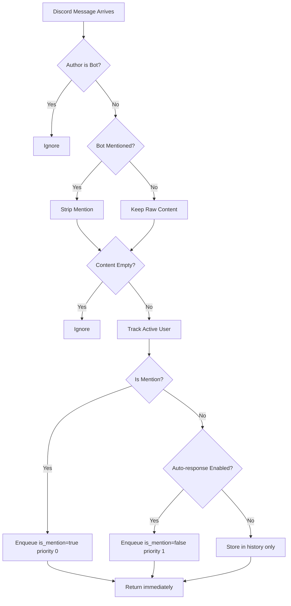
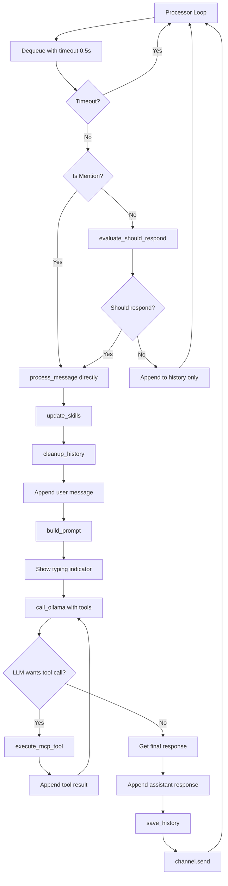
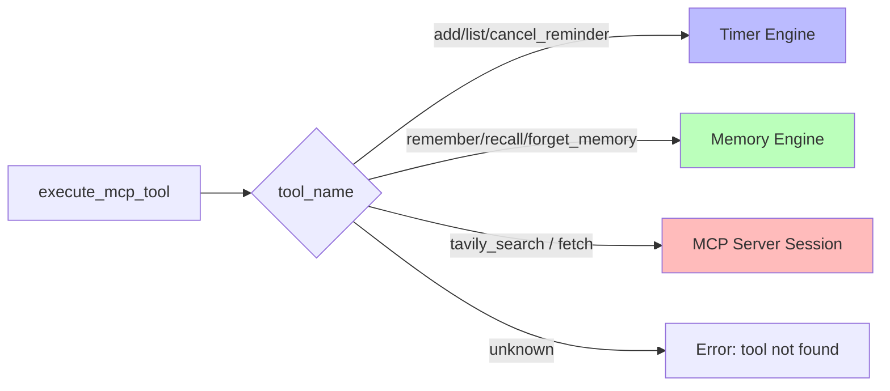
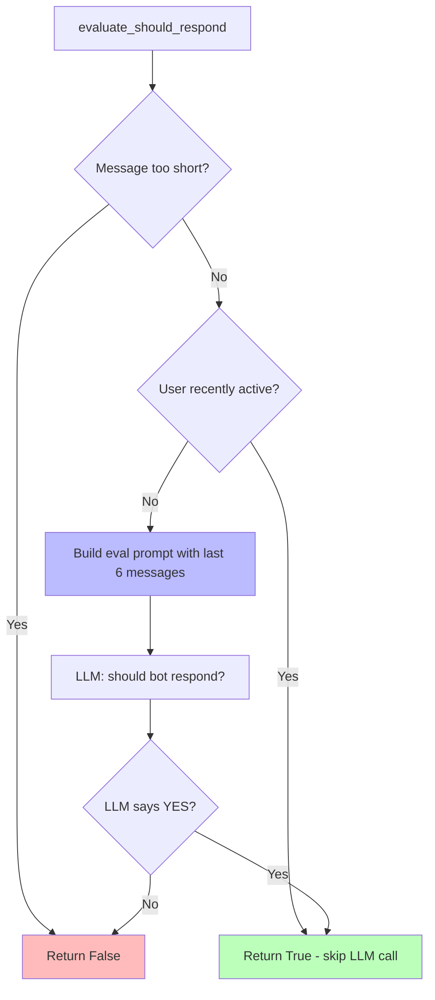
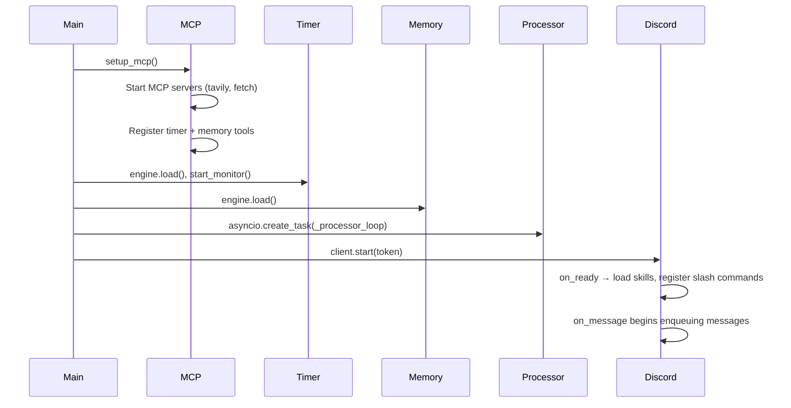
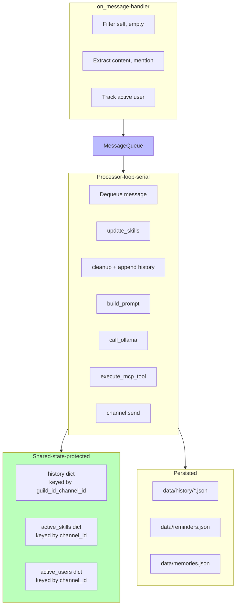

# Message Handling — Architecture

## Overview

The bot receives Discord messages via the `on_message` event handler and **enqueues them immediately** into a priority queue. A background async processor loop drains the queue and processes messages serially. All LLM calls, tool use, and replies happen in the processor loop — the event handler never blocks.

Messages are stored in per-channel history with timestamps and usernames. The bot is aware of the current date and time. All actions are logged at the configured level. Configuration is stored in `config.yaml`.

## Components

| Component | File | Role |
|-----------|------|------|
| `on_message` | `run.py` | Discord event handler — fast enqueue only |
| `MessageQueue` | `engine/message_queue.py` | Priority queue: mentions=0, auto-response=1 |
| `_processor_loop` | `run.py` | Background loop: drain queue → process messages |
| `process_message` | `run.py` | Core pipeline: skills → history → LLM → reply |
| `evaluate_should_respond` | `run.py` | Decides whether to auto-join a conversation (includes history context) |
| `call_ollama` | `run.py` | Calls the LLM with tool-calling support (up to 5 tool rounds) |
| `execute_mcp_tool` | `run.py` | Dispatches tool calls to MCP servers, timer engine, or memory engine |
| `update_skills` | `run.py` | Auto-matches message content to skills; resets on mention |
| `build_prompt` | `run.py` | Assembles system + skill + history messages for the LLM |
| `cleanup_history` | `run.py` | Prunes expired and excess messages from channel history |

---

## Flow Diagrams

### 1. Message Entry Point

### 2. Processor Loop

### 3. Tool Dispatch Routing

### 4. Auto-response Evaluation

### 5. Startup Sequence

---

## Data Flow (State)

---

## Key Design Decisions

### 1. Priority Queue (mentions first)

`MessageQueue` wraps a `heapq`-backed list with priority 0 for mentions and priority 1 for auto-response. This ensures the bot always responds to direct mentions before evaluating channel messages.

### 2. Single processor loop (no locking needed)

The processor loop runs single-threaded in the asyncio event loop, so access to shared state (history, active_skills, active_users) is naturally serialized. No locks required.

### 3. Bounded queue (drops lowest priority)

Default max size is 50. When the queue is full, the message with the highest priority number (auto-response) and oldest timestamp is dropped. Mentions are never dropped while auto-response messages are queued.

### 4. No global mutable author_id

`author_id` is passed as a parameter through the call chain: `process_message(msg: Message) → call_ollama(prompt, msg.author_id) → execute_mcp_tool(name, args, author_id)`. This eliminates shared mutable state between message processing calls.

### 5. Eval prompt includes conversation context

`evaluate_should_respond` includes the last 6 messages from the channel's history in the eval prompt, so the LLM can judge whether responding makes sense in context.

---

## Prior Art — Resolved Issues

All issues from the original design have been resolved:

| Issue | Resolution |
|-------|-----------|
| Blocking event loop | `on_message` only enqueues; processor loop handles all blocking work |
| Global `_current_author_id` | Removed; author_id passed through call chain |
| Race conditions on shared state | Single processor loop serializes all state mutations |
| Redundant skill matching | `update_skills` is the single point of skill matching |
| Eval prompt missing context | Includes last 6 messages from channel history |
| Active-user shortcut broken | Tracks users in both `on_message` and processor loop for consistency |
